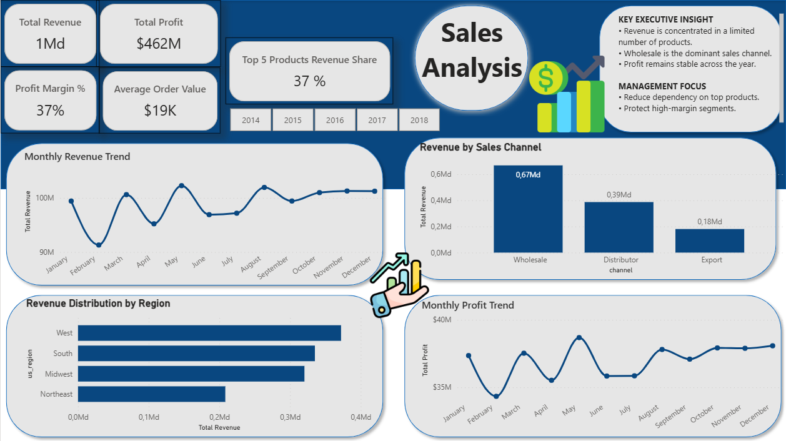
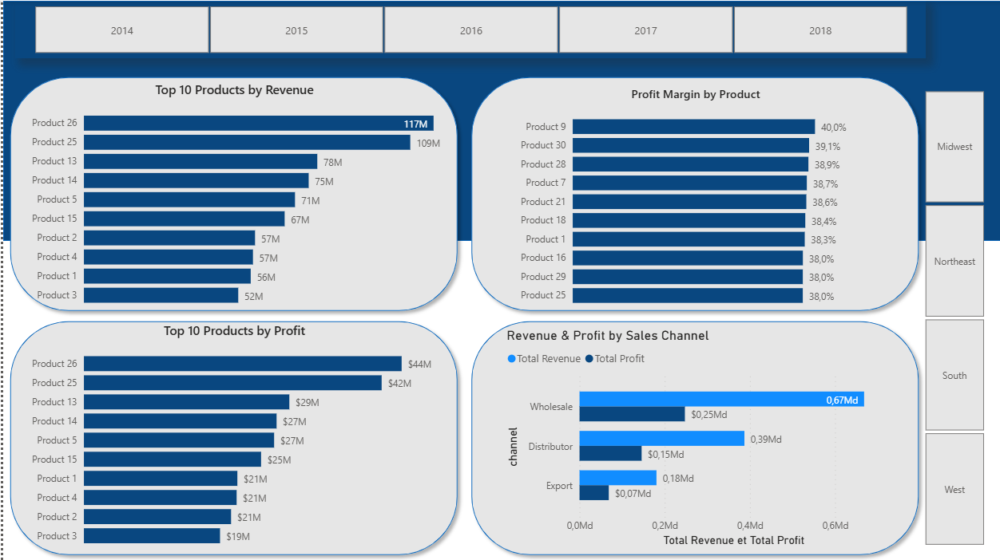
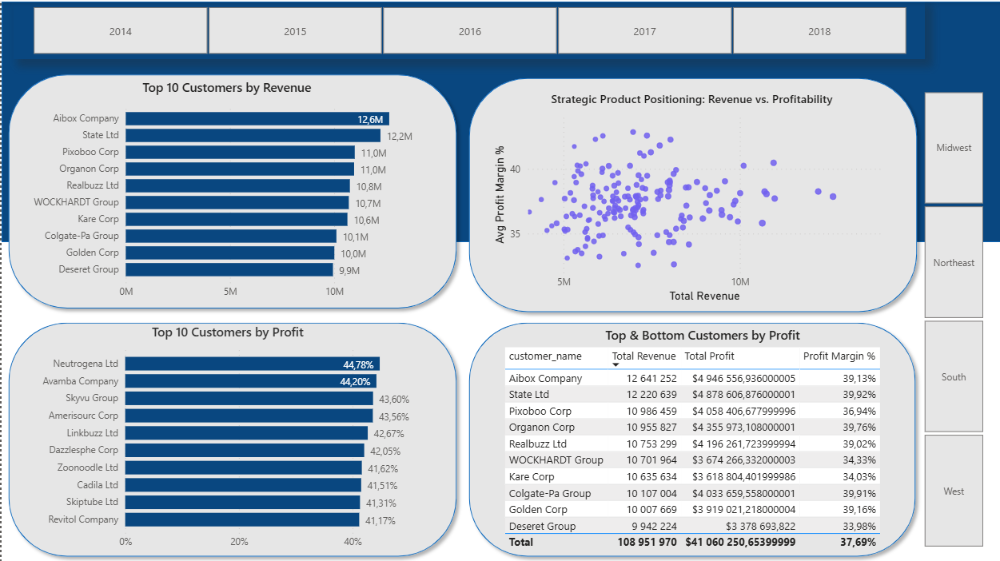

# 📊 Acme Co. Sales Analysis (2014–2018)

## 🔎 Project Overview
This project delivers a **business-oriented sales analysis** for Acme Co., covering U.S. sales from **2014 to 2018**.  
The goal is to transform raw transactional data into **clear, actionable insights** that support executive and sales management decision-making.

The project follows a complete analytics workflow:
- Exploratory Data Analysis (Python)
- KPI definition and feature engineering
- Interactive dashboarding (Power BI)
- Business storytelling and recommendations

---

## 🎯 Business Objectives
- Identify **key revenue and profit drivers**
- Analyze **product and channel performance**
- Detect **seasonality patterns and anomalies**
- Assess **customer concentration and business risk**
- Support **strategic pricing, growth, and channel decisions**

---

## 🧰 Tools & Technologies
- **Python** (Pandas, Matplotlib, Seaborn)
- **Jupyter Notebook** (EDA)
- **Power BI** (Data modeling & dashboards)
- **GitHub** (Project presentation)

---

## 🧪 Exploratory Data Analysis (Python)
The EDA phase focuses on:
- Data cleaning and validation
- Revenue, profit, and margin analysis
- Time-series trends and seasonality
- Outlier detection in pricing and margins
- Product and customer segmentation
- Correlation analysis between key metrics

---

## 📈 Power BI Dashboard
The analysis is delivered through a **3-page Power BI dashboard**, designed for business stakeholders.

---

### 🟦 Page 1 – Executive Overview
High-level KPIs and trends for quick decision-making.

**Key focus:**
- Total Revenue, Total Profit, Profit Margin
- Average Order Value
- Monthly Revenue & Profit Trends
- Revenue by Region and Sales Channel

📸 Preview:  

---

### 🟨 Page 2 – Product & Channel Performance
Deep dive into product portfolio and sales channels.

**Key focus:**
- Top Products by Revenue and Profit
- Profit Margin by Product
- Revenue & Profit by Sales Channel
- Volume vs. profitability trade-offs

📸 Preview:  

---

### 🟥 Page 3 – Customer & Risk Analysis
Customer-level insights to assess concentration risk and value distribution.

**Key focus:**
- Top Customers by Revenue
- Revenue concentration across customer base
- Customer segmentation (Revenue vs. Profit Margin)

📸 Preview:  

---

## 💡 Key Business Insights
- Revenue and profit are highly concentrated across a limited number of products and customers.
- High revenue does not always imply high profitability, highlighting margin optimization opportunities.
- Wholesale channel drives sales volume, while Export channel delivers strong margins at lower scale.
- Customer concentration introduces dependency risk that should be actively managed.

---

## 🚀 Recommendations
- Protect and optimize top-performing products through pricing discipline and cost control.
- Improve margins on high-volume products using targeted efficiency initiatives.
- Selectively scale the Export channel to maximize profitability.
- Diversify the customer base to reduce revenue concentration risk.

---

## 📌 Notes
This project was inspired by a guided tutorial and **independently adapted and extended** with:
- Business-oriented storytelling
- Custom KPIs and dashboard structure
- Original insights and managerial recommendations

---

## 👩‍💼 Author
**Narjisse**  
Master’s Student in Decision Engineering & Data Science  
Aspiring Data Analyst
